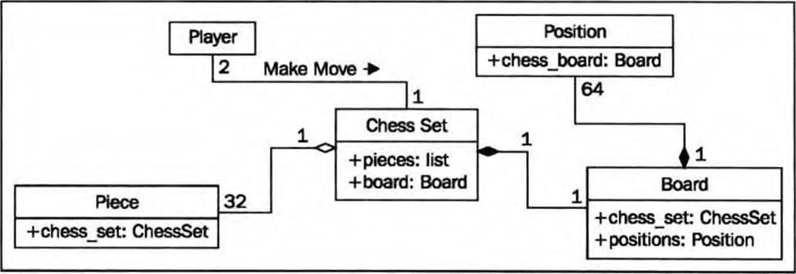
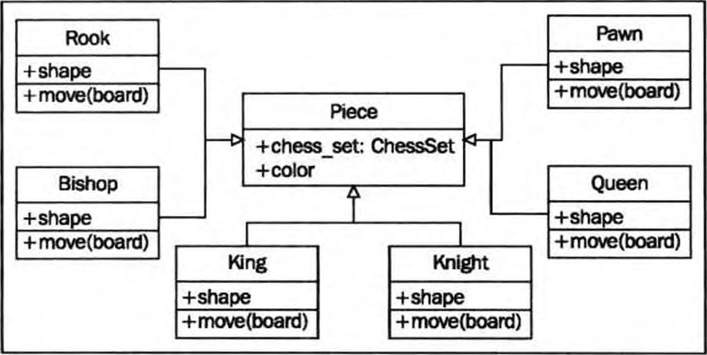

# 面向对象设计

## 隐藏细节并且创建公共接口

在面向对象设计中模块化一个对象的主要目的是决定该对象的**公共接口**  
**接口**是其他对象可以和该对象交互的属性和方法的集合  
例子:
> 我们电视的接口是遥控器。遥控器上的每一个开关代表了一个可以由电视对象调用的方法。当我们作为调用对象去访问这些方法的时候,我们不知道也不关心这个电视是从天线、电缆还是卫星天线获取信号的。我们不关心发送什么电子信号去调节音量,或者声音是输出到扬声器还是耳机。如果我们打开电视访问它的内部T作,例如将输出信号分为去往外部扬声器以及耳机,我们的保修就失效了

### 隐藏细节

隐藏一个对象实现或者功能细节的过程,通常称为信息隐藏。它有时也被称为封装,但是实际封装是一个更加包罗万象的术语。封装数据并不一定是隐藏,但是二者的区别并不重要(一般不进行区分)
封装(Encapsulation)是面向对象的三大特征之一(在这里也可以叫做隐藏).它指的是将对象的状态信息隐藏在对应内部.不允许外部程序直接访问对象内部信息.而是通过**该类所提供的方法**来实现对内部信息的操作和访问

### 公共接口

公共接口是非常重要的。因为在将来很难改变它,所以需要精心设计。改变接口会导致中断任意客户对象对它的调用。我们可以随意改变内部机制,如果我们通过改变公共访问的属性名字,或者改变一个方法可以接收的参数名字或类来改变接口,那么所有客户对象也将必须修改

### 抽象

**抽象意味着要对一个给定任务以最合适的水平来处理细节。它是一个把公共接口从内部细节里抽取的过程**。  

* 一辆车的司机需要与方向盘、油门和刹车交互。而电动机、传动系统以及制动子系统的工作原理对于司机来讲是无关紧要的,
* 另一方面,对丁机械师,优化引擎以及刹车就会有不同水平的抽象

上面两种情况是对一个对象在不同水平上的抽象,最后提供了不同的公共接口

### 总结

抽象就是通过把公共和私有接口分开而封装信息的过程.  
私有接口可以用于信息隐藏(私有接口就是对象内部互相调用使用的接口)

### 组合和继承

组合和继承是设计模式所依赖的两个基本原则,我们通过设计模式来创建一个对象的不同抽象层次,与对象的每一次交互都是在不同的抽上层次上进行

#### 组合与聚合

**组合**:是把一些对象收集在一起组成一个新对象。当一个对象是另一个对象的一部分的时候,组合是一个好的选择  
**聚合**: 象棋是由一个棋盘和32个棋子组成的。棋盘进一步由64个位置组成。你可能会争论说,棋子不是象棋的一部分,因为你可以在象棋里用其他一副棋子把棋子替换掉。虽然在一个计算机版本的象棋里,这是不可能的,但是它给我们引人了聚合。聚合几乎和组合一样,不同的地方是,**聚合对象可以独立存在**。把一个位置和不同的象棋棋盘相关联是不可能的,所以我们说,象棋棋盘是由位置组成的。但是对于棋子,它可以独立于象棋而存在,而被认为和一套象棋是一种聚合关系

##### 区分组合与聚合的方法

当(内部)创建和销毁相应对象(比如:棋盘里一个位置)的时候,如果组合(外部)对象(比如:棋盘)控制着它们,那么组合就是最合适的。如果可以独立于组合对象去创建相关对象(比如:棋子),或者可以对比对象,一个聚合关系可能会有意义;  
聚合是组合的—个更一般的形式。任何组合关系同时也是聚合关系

下面来看一下一个国际象棋的UML图

Player:玩家对象
Plece:棋子对象
Chess Set;象棋对象
Position:棋盘里面每个位置对象
Board:棋盘对象

在UML图里 , **一 个实心菱形**代表了组合关系。**空心菱形**代了聚合关系。你会注意到棋盘和棋子作为象棋的一部分来存储,它们的引用也以同样的方式作为一个属性存储在象棋里

#### 继承

上面对于国际象棋的定义还不够完善,比如,没有定义什么是玩家,我们不能把一个玩家和一个人关联,或者人工智能是玩家对象的一部分,我们想做到的是: 能够说“深蓝是一位玩家”或者“加里•卡斯帕罗夫是一位玩家”.这是一种由继承形成的关系。继承是众所周知最著名的用于面向对象编程的一种关系

##### 一个继承的例子

**32个棋子中不同棋子有不同的形状,移动方式,都可以从基类继承**
在我们的象棋中有32个棋子,但是只有6种不同的类型(兵、车、象、马、王和后),每种类型当它们移动的时候会有不同的行为。所有这些棋子都有如颜色、属于哪副棋的厲性,但是它们在棋盘上也有独特的形状、不同的移动。看一下这6种棋子如何从一个Piece类继承:

空心箭头指明从`Piece类`**继承**来的单个棋子类。所有子类都会自动从基类继承一个`chess_set`和`color`厲性。每一个棋子提供了一个不同的形状属性(当渲染棋盘时会在屏幕上画出这个形状),以及一个不同的`move`方法,每一轮在棋盘上移动这个棋子到一个新的位置.  
我们可以在Piece类里创建一个虚拟的移动方法来实现。子类可以用更具体的实现来**重写**这个方法.例如,默认的实现可能会弹出一个错误消息,提示**这个棋子不能移动**(这个在基类里面实现)。在子类里重写方法允许实现强大的面向对象的系统  
如果要实现一个带有人T:智能的
玩家类,我们可能需要提供一个叫`calculate_move`的方法,这个方法**接收一个棋盘对象**,然后决定哪个棋子要移动到哪里去。一个非常基础的类可能会随机地选择一个棋子和方向(比如上面的piece类),然后移动。然后我们可以在子类里重写这个方法,来实现深蓝。第一个类可能比较适合跟初学选手比赛.其后的可以挑战一位大师(每一个子类的移动方法)

#### 多态

`多态`是依据一个类的不同子类的实现而区别对待这个类的能力  
我们可能会看到棋盘对象可以从玩家那里接收一个移动请求,并且调用这个棋子的 `move` 函数。棋盘不需要知道与之交互的棋子是什么类型的。它所需要做的只是调用 `move` 方法,然后适当的子类会去考虑是要按照车还是兵移动它  
在 Python 中这种多态性通常称为`鸭子类型`: “如果它像鸭子一样走路,像鸭子一样游泳,那么它就是一只鸭子”。我们不关心它是否真的是一只鸭子(继承),只要它可以游泳或者走路。鹅和天鹅很容易能够提供我们正在寻找的像鸭子那样的行为。这允许未来的设计师可以创建新种类的鸟,而不需要真正指定水生鸟类的继承层次结构。这也允许他们创建完全不同的插人式行为,这些行为传统的设计师从没有计划过。例如,未来的设计师可能可以创建一个能走路游泳的企鹅,它具有和鸭子相同的接口而不需要任何建议